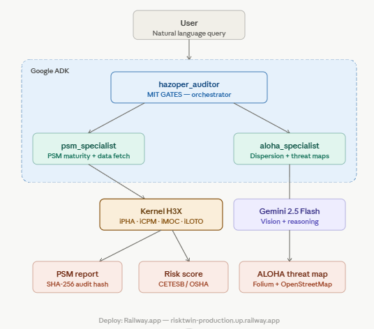

# 🏭 Hazoper — Industrial Risk AI Agent
### Google for Startups AI Agents Challenge 2026 — Track 3

> **"We don't just audit risk. We guarantee it."**
> Powered by Google ADK · Gemini 2.5 Flash · Kernel H3X · MCP

---

## 🚨 The Problem

Every year, industrial accidents in Brazil cause **billions in losses**, environmental disasters, and human casualties. The root cause? Manual, slow, and inconsistent risk audits.

- A HAZOP analysis takes **3–6 months** with human consultants
- Risk scoring is **subjective** — no two analysts reach the same conclusion
- There's **no immutable audit trail** — results can be changed after the fact
- **LGPD compliance** requires data isolation between clients

---

## 💡 Our Solution

**Hazoper** is an autonomous AI agent that audits industrial plants in **minutes**, not months.

Built on the **Google Agent Development Kit (ADK)**, Hazoper orchestrates a team of specialized sub-agents that:

1. **Analyze P&ID drawings** using Gemini Vision
2. **Calculate PSM maturity scores** via Kernel H3X (our proprietary engine)
3. **Generate ALOHA dispersion maps** with real threat zones on interactive maps
4. **Produce immutable audit reports** with SHA-256 cryptographic signatures

---

## ✅ Real-World Validation

> *"The information is correct. The problems are right in our face — what's critical, what we're failing at. Inspections not done, actions needed to make the plant safer. It's all there and now it's explicit."*
> — **PSM Engineer, ABL Cosmópolis** (0 corrections requested)

- Replaces a consultant charging **R$ 20,000/month** for the same audit
- **0 corrections** requested after full PSM team review
- Client requested 3-level safety training based on the report

---

## 🤖 Agent Architecture

```
hazoper_auditor (MIT GATES — Orchestrator)
    ├── psm_specialist        → Fetches plant data + calculates PSM maturity
    └── aloha_specialist      → Analyzes worst-case dispersion scenarios + generates maps
```

### How it works

```
User: "Audit ABL Cosmópolis plant"
        ↓
hazoper_auditor delegates to psm_specialist
        ↓
psm_specialist fetches plant data automatically (no manual input)
        ↓
Kernel H3X calculates: iPHA · iCPM · iMOC · iLOTO
        ↓
SHA-256 hash generated — immutable audit trail
        ↓
aloha_specialist identifies worst-case dispersion scenario
        ↓
Interactive threat zone map generated (Red · Orange · Yellow zones)
        ↓
Integrated Risk Report delivered in natural language
```

---

## 🔑 Key Differentiators

| Feature | Traditional Audit | Hazoper |
|---|---|---|
| Time to audit | 3–6 months | Minutes |
| Reproducibility | Subjective | 100% deterministic |
| Audit trail | None | SHA-256 immutable |
| Multi-norm support | Single norm | CETESB P4.261 + OSHA 1910.119 |
| Threat zone maps | Manual (ALOHA software) | Automated + interactive |
| Business ROI | Unknown | 120x calculated |
| Consultant cost | R$ 20k/month | Automated |

---

## 🧠 Kernel H3X — Our Proprietary Engine

The **Kernel H3X** is our trade-secret PSM scoring engine, registered with Brazil's **INPI** (National Intellectual Property Institute).

Key properties:
- **Norm-agnostic** — Strategy Pattern + JSON compliance profiles
- **AI Assurance** — Chain of Custody with SHA-256 on every calculation
- **Reproducible** — same inputs always produce the same result + hash
- **Auditable** — persistent SQLite log of every audit event

---

## 🔌 MCP Ready — Zero Vendor Lock-in

The Kernel H3X is exposed via **Model Context Protocol (MCP)** — the open standard adopted by Google, OpenAI and Anthropic.

Any AI agent can call the PSM engine directly:

```
Gemini Agent  ──→ MCP ──→ calcular_maturidade_psm()
Claude        ──→ MCP ──→ listar_cenarios_aloha()
Custom Agent  ──→ MCP ──→ gerar_mapa_aloha()
```

This makes Hazoper the **infrastructure layer** for industrial risk — not just a product.

---

## 🗺️ ALOHA Dispersion Module

Real threat zones on interactive maps using Folium + OpenStreetMap:
- 🔴 Red Zone — Immediate danger (fatality risk)
- 🟠 Orange Zone — Injury zone
- 🟡 Yellow Zone — Alert zone

Based on NOAA ALOHA 5.4.4 with real plant coordinates.

---

## 📊 Real-World Impact — ABL Cosmópolis

- Assets protected: **R$ 380 million**
- PSM maturity: **69.6%** (action required)
- Critical finding: **iLOTO = 17%** (Lockout/Tagout critically deficient)
- ROI of prevention investment: **120x**
- Worst-case scenario: **S-07** — Flammable LEL, 0.8 m/s wind, stability F
- Validation: **PSM team reviewed, 0 corrections**

---

## 🚀 Try It

```bash
pip install -r requirements.txt
echo 'GOOGLE_API_KEY="your_key"' > hazoper_agent/.env
adk web --port 8080
```

Open **http://127.0.0.1:8080** and type:

```
Audit the ABL Cosmópolis plant and show the worst ALOHA scenario.
```

---

## 🏗️ Tech Stack

| Component | Technology |
|---|---|
| Agent framework | Google ADK 1.33.0 |
| AI model | Gemini 2.5 Flash |
| Risk engine | Kernel H3X v1.2-rc (INPI protected) |
| Threat maps | Folium + OpenStreetMap |
| Audit trail | SQLite + SHA-256 |
| Interoperability | MCP (Model Context Protocol) |
| Deploy | Railway.app |

---

## 📜 Track 3 Alignment

- ✅ Existing MVP refactored with Google ADK
- ✅ Multi-agent orchestration with delegation
- ✅ Enterprise AI Assurance (SHA-256 Chain of Custody)
- ✅ MCP-ready — works with any AI provider
- ✅ Real client validation — 0 corrections from PSM team
- ✅ Google Cloud Marketplace ready



---

## 👥 Team

| Name | Role |
|---|---|
| Daniel Wege | CEO / Product Architecture — ESUPERCORP |
| Gabriel Hernandez Rozo | Software Engineer / Kernel H3X Author (INPI) |

---

*HAZOPER © 2026 ESUPERCORP.COM — Protecting R$ 380M in industrial assets with AI Assurance.*
